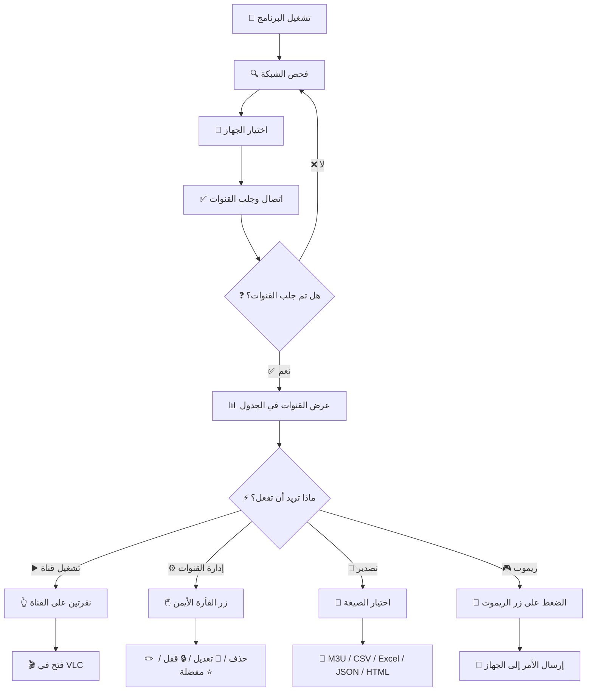
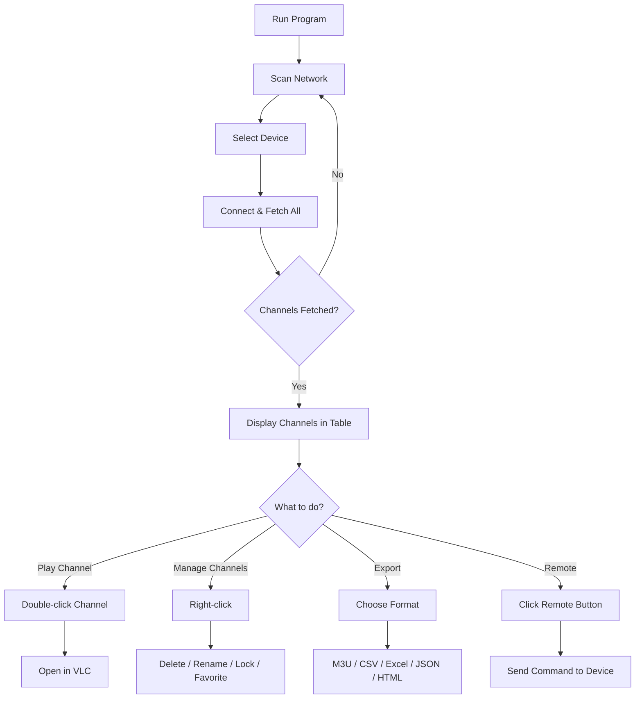

# G-MScreen-PC-Remote-Control-all-Version

---

# G-MScreen-PC-Remote-Control

<div align="center">
  
  
  *MScreen Universal Controller PC*
</div>

---

<div align="center">

#  MScreen Universal Controller 

### 🔍 Receiver Manager & Remote Control Suite 🔍

#### *Manage. Control. Extract. Stream.*

<p>
  
  
  
  
  
</p>

<p>
  
  
  
  
</p>

---

### ✨ *Control Your Satellite Receiver from PC in Seconds* ✨

</div>

---

<div align="center">
  
  <a href="#arabic"></a>&nbsp;&nbsp;&nbsp;
  <a href="#english"></a>
  
</div>

---

<!-- ======================== ARABIC SECTION ======================== -->
<div id="arabic" dir="rtl">

# <div align="center">🇸🇦 العربية</div>

<div align="center">
  
  
  
  <br><br>
  
  <h2>⚡ أقوى أداة للتحكم وإدارة أجهزة الاستقبال عن بعد ⚡</h2>
  
  <p>
    
  </p>
  
</div>

---

## 📋 المحتويات

| القسم | الوصف |
|-------|-------|
| <a href="#overview-ar">📌 نظرة عامة</a> | ما هو البرنامج؟ |
| <a href="#features-ar">✨ جميع المميزات بالتفصيل</a> | كل إمكانيات البرنامج |
| <a href="#connection-ar">🔌 الاتصال بالشبكة</a> | طرق الاتصال بالجهاز |
| <a href="#channels-ar">📺 إدارة القنوات</a> | جلب، تحرير، بحث، تصفية |
| <a href="#remote-ar">🎮 الريموت الافتراضي</a> | جميع أزرار التحكم |
| <a href="#playback-ar">▶️ التشغيل والتسجيل</a> | VLC، تسجيل البث |
| <a href="#export-ar">💾 التصدير والاستخراج</a> | جميع صيغ التصدير |
| <a href="#device-ar">ℹ️ معلومات الجهاز</a> | بيانات الرسيفر |
| <a href="#server-ar">🌐 خدمات السيرفر</a> | فحص الاشتراكات |
| <a href="#versions-ar">📱 الإصدارات المتاحة</a> | جميع الإصدارات |
| <a href="#download-ar">📥 التحميل</a> | روابط التنزيل |
| <a href="#usage-ar">🚀 دليل الاستخدام</a> | خطوات التشغيل |
| <a href="#requirements-ar">⚙️ متطلبات التشغيل</a> | المتطلبات اللازمة |
| <a href="#notes-ar">⚠️ ملاحظات هامة</a> | تنبيهات مهمة |

---

<div id="overview-ar"></div>

## 📌 نظرة عامة

<div style="background: linear-gradient(135deg, #1a1a2e 0%, #16213e 100%); padding: 25px; border-radius: 15px; border-right: 5px solid #4CAF50;">

**MScreen Universal Controller - Receiver Manager & Remote V26.1** هو الحل المتكامل للتحكم وإدارة أجهزة الاستقبال التي تدعم بروتوكول **MScreen** أو **G-Screen** من الكمبيوتر.

### ما هو البرنامج؟

برنامج ذكي للتحكم الكامل بأجهزة الرسيفرات (جميع الأجهزة التي تدعم G-MScreen / MScreen) عبر الشبكة المحلية من خلال الكمبيوتر، وهو **بديل MScreen للكمبيوتر**. يعتمد البرنامج على بروتوكول MScreen للاتصال المباشر مع الرسيفر، ويوفر واجهة رسومية سهلة وسريعة لإدارة القنوات والتحكم بالجهاز وتشغيل البث على الكمبيوتر.

</div>

---

<div id="features-ar"></div>

## ✨ جميع المميزات بالتفصيل

<div align="center">

### 🎮 التحكم عن بعد (الريموت الافتراضي)

| الميزة | التفاصيل |
|--------|----------|
| **ريموت متكامل** | أكثر من 50 زر تحكم بجميع وظائف الريموت الأصلي |
| **أزرار التحكم الأساسية** | تشغيل/إيقاف، صوت +/-, قناة +/-, كتم الصوت |
| **أزرار الأرقام** | 0-9 لإدخال أرقام القنوات مباشرة |
| **أزرار التنقل** | أسهم الاتجاهات (↑ ↓ → ←)، OK، خروج، قائمة |
| **الأزرار الملونة** | أحمر، أخضر، أصفر، أزرق (وظائف حسب القائمة) |
| **أزرار خاصة** | EPG (دليل البرامج)، FAV (المفضلة)، SAT (الأقمار)، USB، INFO، TV/RADIO |
| **أزرار إضافية** | PVR، Timeshift، Subtitle، Audio، Zoom، Page Up/Down |
| **إرسال أوامر مخصصة** | إمكانية إرسال أوامر بصيغة JSON أو إدخال رقم الأمر مباشرة |
| **الاختصارات المتقدمة** | نافذة تحتوي على جميع اختصارات جهاز التحكم (مثل F1+111 وغيرها) |

### 📡 جلب القنوات وعرضها

| الميزة | التفاصيل |
|--------|----------|
| **جلب جميع القنوات دفعة واحدة** | استخراج كل القنوات من الجهاز مع بياناتها الكاملة |
| **معلومات تفصيلية لكل قناة** | اسم القناة، القمر الصناعي، التردد، الاستقطاب (H/V)، معدل الترميز (SR) |
| **نوع القناة** | TV / Radio |
| **الجودة** | HD / SD |
| **الحالة** | مفتوحة / مشفرة / مقفولة |
| **رقم القناة** | ترتيب القناة في الجهاز |
| **عرض القناة المشغلة حالياً** | معرفة القناة المفتوحة على الرسيفر في أي لحظة |
| **تحديث روابط البث** | تحديث روابط البث (Stream URLs) لجميع القنوات دفعة واحدة |

### ✏️ تحرير القنوات وإدارتها

| الميزة | التفاصيل |
|--------|----------|
| **إعادة تسمية** | تغيير أسماء القنوات (فردي أو جماعي) |
| **حذف** | حذف قناة واحدة أو عدة قنوات محددة دفعة واحدة |
| **نقل** | نقل القنوات (فردي أو جماعي) إلى مواقع مختلفة |
| **قفل / فك قفل** | حماية القنوات بكلمة مرور الجهاز |
| **المفضلة** | إضافة قناة إلى المجموعات المفضلة أو إزالتها |
| **نسخ المعلومات** | نسخ اسم القناة، التردد، أو رابط البث بنقرة واحدة |
| **الترتيب** | إعادة ترتيب القنوات في القائمة |

### 🔍 البحث والتصفية والفرز المتقدم

| نوع البحث | الوصف |
|-----------|-------|
| **البحث بالاسم** | بحث نصي فوري في أسماء القنوات |
| **البحث برقم القناة** | البحث حسب رقم الصف/الترتيب |
| **البحث بالتردد** | البحث حسب قيمة التردد |

**التصفية حسب:**
- النوع (تلفاز / راديو)
- الجودة (HD / SD)
- الحالة (مفتوحة / مشفرة / مقفولة)
- القمر الصناعي (سواتل مختلفة)

**الفرز حسب:**
- الاسم (تصاعدي/تنازلي)
- رقم القناة
- التردد
- القمر الصناعي

### ▶️ تشغيل القنوات على الكمبيوتر

| الميزة | التفاصيل |
|--------|----------|
| **الانتقال إلى القناة** | بنقرتين على القناة في الجدول، ينتقل الجهاز إليها فوراً |
| **فتح في VLC** | تشغيل القناة مباشرة في مشغل VLC Media Player |
| **عرض معلومات القناة** | الاسم، القمر، التردد، الرقم، رابط البث قبل التشغيل |
| **إنشاء ملف M3U مؤقت** | للتشغيل الفوري أو للحفظ لاحقاً |
| **التشغيل بدون فتح البرنامج** | بعد حفظ القنوات كـ M3U، يمكن تشغيلها مباشرة من VLC دون فتح البرنامج |

> ⚠️ **ملاحظة:** يشترط أن تكون القناة نفسها مفتوحة على الجهاز ليعمل رابط البث.

### ⏺ تسجيل البث المباشر

| الميزة | التفاصيل |
|--------|----------|
| **تسجيل بجودة عالية** | تسجيل القناة المشغلة حالياً على الجهاز |
| **تنسيق التسجيل** | حفظ التسجيل بصيغة TS أو MP4 |
| **موقع الحفظ** | اختيار المجلد المفضل لحفظ التسجيلات |
| **إيقاف التسجيل** | التحكم ببدء وإيقاف التسجيل يدوياً |

### 💾 التصدير والاستخراج الاحترافي

| الصيغة | الاستخدام | التفاصيل |
|--------|-----------|----------|
| **M3U** | مشغلات البث | ملف نصي يحتوي على روابط القنوات، يعمل مع VLC وبرامج الـ IPTV |
| **CSV** | جداول البيانات | يمكن فتحه في Excel أو أي برنامج جداول |
| **Excel (XLSX)** | Microsoft Excel | تنسيق متوافق مع جميع إصدارات Excel |
| **JSON** | التطبيقات البرمجية | للتطوير والمبرمجين، يمكن دمجه مع تطبيقات أخرى |
| **HTML** | المتصفحات | صفحة ويب تفاعلية تعرض القنوات وجدولها |

### 🌐 خدمات السيرفر والمعلومات المدمجة

| الخدمة | الوظيفة |
|--------|----------|
| **فحص الاشتراكات (IKS + G-Share)** | فحص حالة الاشتراك حسب الجهاز المتصل مباشرة |
| **فحص الاشتراك برقم السيريل** | إدخال الرقم التسلسلي (Serial Number) للجهاز وفحص اشتراكه |
| **البحث عن تحديثات الجهاز** | البحث عن تحديثات سوفتوير للجهاز المتصل مباشرة |

### ℹ️ معلومات الجهاز

| المعلومة | التفاصيل |
|----------|----------|
| **اسم الجهاز** | اسم الموديل كما يظهر في الجهاز |
| **إصدار السوفتوير** | رقم إصدار البرنامج الثابت (Firmware) |
| **الرقم التسلسلي (Serial)** | الرقم الفريد للجهاز |
| **عنوان IP** | عنوان الجهاز على الشبكة المحلية |
| **عدد القنوات الكلي** | إجمالي القنوات (TV + Radio) |
| **عدد قنوات التلفاز** | عدد القنوات التلفزيونية فقط |
| **عدد قنوات الراديو** | عدد القنوات الإذاعية فقط |
| **حالة الاتصال** | متصل / غير متصل / زمن الاستجابة (Ping) |

### 🎨 واجهة المستخدم

| الميزة | التفاصيل |
|--------|----------|
| **الوضع الليلي** | دعم الوضع المظلم (Dark Mode) للاستخدام الليلي |
| **الوضع الفاتح** | الوضع العادي (Light Mode) |
| **تخصيص حجم الخط** | تغيير حجم الخط في الواجهة |
| **اللغة** | دعم كامل للغة العربية واللغة الإنجليزية |
| **شريط الحالة** | عرض عدد القنوات، حالة الاتصال، القناة المشغلة حالياً |

### 🔌 إعدادات متعددة للأجهزة

| الميزة | التفاصيل |
|--------|----------|
| **حفظ إعدادات متعددة** | حفظ إعدادات أكثر من جهاز (IP، منفذ، اسم الجهاز) |
| **التبديل السريع** | التبديل بين الأجهزة المحفوظة بنقرة واحدة |
| **نسخة احتياطية للإعدادات** | حفظ الإعدادات واستعادتها عند الحاجة |

### 📊 إحصائيات حية

| الإحصائية | التفاصيل |
|-----------|----------|
| **عدد القنوات الكلي** | يظهر في شريط الحالة |
| **عدد المفضلات** | عدد القنوات المضافة إلى المفضلة |
| **القناة المشغلة حالياً** | اسم القناة المفتوحة على الجهاز |
| **حالة الاتصال** | متصل/غير متصل وزمن الاستجابة |

### 🌐 مواقع الترددات المدمجة (روابط سريعة)

| الموقع | الرابط |
|--------|--------|
| Lyngsat | lyngsat.com |
| Flysat | flysat.com |
| KingOfSat | kingofsat.net |

### 📚 مراجع ودعم فني (روابط سريعة)

| الموقع | الوصف |
|--------|-------|
| **Tunisia-Sat** | المنتدى الأول للدعم الفني |
| **SatDL.com** | مكتبة شاملة للملفات |
| **CWDW.net** | التحديثات الرسمية |
| **SWDW.net** | قاعدة بيانات السوفتوير |

</div>

---

<div id="connection-ar"></div>

## 🔌 الاتصال والتحكم بالشبكة

| الميزة | التفاصيل |
|--------|----------|
| **الاتصال المباشر** | الاتصال بالرسيفر عبر IP الشبكة المحلية (Local Network) |
| **فحص تلقائي للشبكة** | اكتشاف جميع أجهزة MScreen المتصلة بالشبكة تلقائياً |
| **منفذ TCP** | البحث عن الأجهزة عبر منفذ 20000 (المنفذ الافتراضي لبروتوكول MScreen) |
| **إدخال IP يدوياً** | عند عدم ظهور الجهاز في الفحص التلقائي، يمكن إدخال IP يدوياً |
| **إدخال المنفذ يدوياً** | تغيير المنفذ إذا كان الجهاز يستخدم منفذاً مختلفاً |
| **إعادة اتصال تلقائية** | عند انقطاع الشبكة، يحاول البرنامج إعادة الاتصال تلقائياً |
| **عرض زمن الاستجابة** | عرض Ping وحالة الاتصال وجودة الشبكة |
| **تحديد جهاز من القائمة** | عند وجود أكثر من جهاز على الشبكة، تظهر قائمة للاختيار |

---

<div id="channels-ar"></div>

## 📺 إدارة القنوات بالتفصيل

### خطوات جلب القنوات

1. الاتصال بالجهاز عبر IP
2. الضغط على زر **"اتصال وجلب الكل"** أو **"جلب القنوات"**
3. انتظار تحميل القنوات (الوقت يعتمد على عدد القنوات)
4. ظهور القنوات في الجدول الرئيسي مع جميع البيانات

### التعامل مع الجدول

| الإجراء | النتيجة |
|---------|---------|
| **نقرتين على قناة** | الانتقال إليها على الجهاز + فتح نافذة خيارات التشغيل |
| **زر الفأرة الأيمن** | فتح قائمة السياق (نسخ، تعديل، حذف، قفل، مفضلة) |
| **تحديد عدة قنوات** | Ctrl + نقر لتحديد متعدد، Shift + نقر لتحديد نطاق |
| **سحب وإفلات** | إعادة ترتيب القنوات (في بعض الإصدارات) |

### قائمة السياق (زر الفأرة الأيمن)

- نسخ اسم القناة
- نسخ رابط البث
- نسخ التردد
- إعادة تسمية
- حذف
- نقل إلى
- قفل / فك قفل
- إضافة إلى المفضلة
- إزالة من المفضلة

---

<div id="remote-ar"></div>

## 🎮 الريموت الافتراضي - جميع الأزرار

### الأزرار الأساسية

| الزر | الوظيفة |
|------|---------|
| **الطاقة (Power)** | تشغيل/إيقاف الجهاز |
| **الصوت +** | رفع الصوت |
| **الصوت -** | خفض الصوت |
| **كتم (Mute)** | كتم/إلغاء كتم الصوت |
| **قناة +** | القناة التالية |
| **قناة -** | القناة السابقة |
| **الأرقام (0-9)** | الانتقال إلى رقم القناة مباشرة |

### أزرار التنقل

| الزر | الوظيفة |
|------|---------|
| **↑ (أعلى)** | تحريك المؤشر لأعلى |
| **↓ (أسفل)** | تحريك المؤشر لأسفل |
| **→ (يمين)** | تحريك المؤشر لليمين |
| **← (يسار)** | تحريك المؤشر لليسار |
| **OK** | تأكيد / تحديد |
| **خروج (Exit)** | العودة للخلف / إغلاق القائمة |
| **قائمة (Menu)** | فتح القائمة الرئيسية |

### الأزرار الملونة

| الزر | الوظيفة (تختلف حسب القائمة) |
|------|------------------------------|
| **أحمر (Red)** | وظيفة خاصة حسب السياق |
| **أخضر (Green)** | وظيفة خاصة حسب السياق |
| **أصفر (Yellow)** | وظيفة خاصة حسب السياق |
| **أزرق (Blue)** | وظيفة خاصة حسب السياق |

### الأزرار الخاصة

| الزر | الوظيفة |
|------|---------|
| **EPG** | دليل البرامج (Electronic Program Guide) |
| **FAV** | فتح قائمة المفضلة |
| **SAT** | قائمة الأقمار الصناعية |
| **USB** | فتح قائمة الوسائط من USB |
| **INFO** | معلومات القناة الحالية |
| **TV/RADIO** | التبديل بين التلفاز والراديو |
| **PVR** | قائمة التسجيل (Personal Video Recorder) |
| **Timeshift** | الإيقاف المؤقت للبث الحي |
| **Subtitle** | تشغيل/إيقاف الترجمة |
| **Audio** | تغيير المسار الصوتي |
| **Zoom** | تكبير/تصغير الصورة |
| **Page Up** | الصفحة السابقة في القائمة |
| **Page Down** | الصفحة التالية في القائمة |

### الأوامر المخصصة

| الميزة | التفاصيل |
|--------|----------|
| **إدخال رقم الأمر** | إرسال أي أمر برقمه (للتجربة أو الأزرار غير الموجودة) |
| **JSON المخصص** | إرسال أوامر بصيغة JSON للتطوير المتقدم |

---

<div id="playback-ar"></div>

## ▶️ التشغيل والتسجيل

### التشغيل في VLC

| الخطوة | الإجراء |
|--------|---------|
| 1 | التأكد من تثبيت VLC Media Player على الكمبيوتر |
| 2 | النقر مرتين على القناة المطلوبة في الجدول |
| 3 | اختيار "فتح في VLC" من النافذة المنبثقة |
| 4 | انتظار فتح VLC وتشغيل البث |

### التسجيل

| الخطوة | الإجراء |
|--------|---------|
| 1 | تشغيل القناة المطلوبة في VLC أولاً |
| 2 | الضغط على زر "تسجيل" في البرنامج |
| 3 | اختيار مجلد الحفظ (اختياري) |
| 4 | الضغط على "إيقاف" لإنهاء التسجيل |

> ⚠️ **ملاحظة هامة:** التسجيل يعمل فقط على القناة التي يتم تشغيلها حالياً في VLC.

---

<div id="export-ar"></div>

## 💾 التصدير - جميع الصيغ بالتفصيل

### صيغة M3U

```
#EXTM3U
#EXTINF:-1 tvg-name="قناة 1" group-title="الترفيه",قناة 1
http://ip:port/stream/channel/1
#EXTINF:-1 tvg-name="قناة 2" group-title="الأخبار",قناة 2
http://ip:port/stream/channel/2
```

**الاستخدام:** VLC، برامج IPTV، Kodi، TV Headend

### صيغة CSV

```csv
الرقم,الاسم,التردد,الاستقطاب,معدل الترميز,القمر,الجودة,الحالة
1,قناة 1,12345,H,27500,نايل سات,HD,مفتوحة
2,قناة 2,12346,V,27500,عرب سات,SD,مشفرة
```

**الاستخدام:** Excel، Google Sheets، أي برنامج جداول بيانات

### صيغة Excel (XLSX)

ملف إكسل كامل مع:
- أعمدة منسقة
- إمكانية الفرز والتصفية داخل Excel
- يدعم جميع إصدارات Excel من 2007 فما فوق

### صيغة JSON

```json
{
  "channels": [
    {
      "number": 1,
      "name": "قناة 1",
      "frequency": 12345,
      "polarization": "H",
      "symbolRate": 27500,
      "satellite": "نايل سات",
      "quality": "HD",
      "status": "open",
      "streamUrl": "http://ip:port/stream/channel/1"
    }
  ]
}
```

**الاستخدام:** التطبيقات البرمجية، APIs، المطورين

### صيغة HTML

صفحة ويب تفاعلية تحتوي على:
- جدول عرض القنوات
- أزرار فرز وتصفية
- تصميم متجاوب (Responsive)
- يدعم الوضع المظلم والفاتح تلقائياً

---

<div id="device-ar"></div>

## ℹ️ معلومات الجهاز

| الحقل | الوصف | مثال |
|-------|-------|------|
| **اسم الجهاز** | موديل الرسيفر | HD-2000 |
| **إصدار السوفتوير** | رقم إصدار البرنامج الثابت | v1.2.3 |
| **الرقم التسلسلي** | الرقم الفريد للجهاز (Serial) | 1234567890ABCDEF |
| **عنوان IP** | IP الجهاز على الشبكة | 192.168.1.100 |
| **البوابة الافتراضية** | عنوان الراوتر | 192.168.1.1 |
| **قنوات TV** | عدد قنوات التلفاز | 1500 |
| **قنوات Radio** | عدد القنوات الإذاعية | 50 |
| **المجموع** | إجمالي القنوات | 1550 |
| **حالة الاتصال** | متصل / غير متصل | متصل |
| **زمن الاستجابة** | Ping بالمللي ثانية | 2ms |

---

<div id="server-ar"></div>

## 🌐 خدمات السيرفر والمعلومات المدمجة

### روابط السيرفر المباشرة (نوافذ مدمجة في البرنامج)

| الخدمة | الرابط | الوظيفة |
|--------|--------|----------|
| **IKS GO Check** | iksgo.com/check | فحص حالة اشتراك السيرفر |
| **IKS GO Renew** | iksgo.com/renew | تجديد الاشتراك الرسمي |
| **DZAGAME Check** | check.dzagame.com | التحقق من الرقم التسلسلي |
| **IKSGo Models** | iksgo.com/models-page | معرفة السوفتوير المناسب لجهازك |
| **Metamango** | metamango.org | إدارة الأجهزة المتقدمة |

### مواقع الترددات (روابط سريعة مدمجة)

| الموقع | الرابط | الوصف |
|--------|--------|-------|
| **Lyngsat** | lyngsat.com | قاعدة بيانات الترددات العالمية |
| **Flysat** | flysat.com | تحديثات يومية للترددات |
| **KingOfSat** | kingofsat.net | ترددات الأقمار العربية والعالمية |

### مراجع ودعم فني (روابط سريعة مدمجة)

| الموقع | الرابط | الوصف |
|--------|--------|-------|
| **Tunisia-Sat** | tunisia-sat.com | المنتدى الأول للدعم الفني |
| **SatDL.com** | satdl.com | مكتبة شاملة للملفات والسوفتوير |
| **CWDW.net** | cwdw.net | التحديثات الرسمية |
| **SWDW.net** | swdw.net | قاعدة بيانات السوفتوير |

---

<div id="versions-ar"></div>

## 📱 الإصدارات المتاحة

<div align="center">

### ⭐ Starsat Remote Control only (الإصدار 1.8.0)

برنامج ذكي للتحكم الكامل بأجهزة ستارسات عبر الشبكة من خلال الكمبيوتر بجميع الأزرار

**المميزات:**
- الاتصال بالجهاز عبر IP وPort
- إعادة الاتصال تلقائياً عند انقطاع الشبكة
- إرسال أوامر الريموت بجميع الأزرار المعروفة
- إرسال أوامر الريموت برقم القناة
- إمكانية تجربة أزرار أخرى غير الموجودة بالبرنامج من خلال كتابة رقم الأمر فقط
- دعم إرسال أوامر مخصصة بصيغة JSON
- فحص الشبكة التلقائي للبحث عن الأجهزة عبر منفذ TCP (20000)
- عرض الأجهزة المتوفرة واختيارها بسهولة

**الحجم:** ~15 MB

---

### ⭐ Starsat Remote Control (الإصدار 2.2.0)

بديل برنامج G-MScreen - برنامج ذكي للتحكم الكامل بأجهزة ستارسات عبر الشبكة من خلال الكمبيوتر

**الاستخدامات الشائعة:**
- التحكم بجهاز ستارسات دون الحاجة إلى الريموت
- تشغيل القنوات على الكمبيوتر مباشرة عبر VLC
- تسجيل البث من القنوات بجودة عالية
- إدارة القنوات: حذف، إعادة تسمية، قفل، نقل قناة
- تصفح القنوات بسهولة مع دعم البحث والتصفية
- حفظ القنوات بصيغة M3U لتشغيلها لاحقاً دون الحاجة لفتح البرنامج
- عرض معلومات الجهاز والاتصال به عبر الشبكة المحلية

**المميزات الإضافية:**
- دعم EPG
- تصدير القنوات إلى: CSV، Excel، JSON، HTML، M3U
- حفظ نسخة احتياطية من الإعدادات واستعادتها
- إعدادات مرنة: حفظ وتعديل إعدادات متعددة لأجهزة Starsat
- إحصائيات حية: عرض عدد القنوات، المفضلات، القناة المشغلة

**الحجم:** ~25 MB

---

### 🚀 G-MScreen-PC Remote Control v2.6.1

**أفضل بديل لبرنامج MScreen على الكمبيوتر** - للتحكم بالرسيفر عبر الشبكة بسهولة واحترافية

**المميزات:**
- 🎮 ريموت افتراضي للتحكم الكامل بالرسيفر
- 📺 تشغيل القنوات على الكمبيوتر عبر VLC
- ⏺ تسجيل البث المباشر بجودة عالية
- 📂 إدارة القنوات بسهولة (حذف – ترتيب – إعادة تسمية – قفل)
- 📤 تصدير القنوات بعدة صيغ: M3U / CSV / Excel / JSON / HTML
- 🔎 فحص الشبكة تلقائياً لاكتشاف الرسيفر
- 🌙 دعم اللغة العربية + الوضع الليلي والفاتح

**الحجم:** ~36 MB

</div>

<div style="background: #331f00; padding: 15px; border-radius: 10px; text-align: center; margin-top: 20px;">
  ⚠️ <strong>ملاحظة هامة:</strong> قد يكون لكل نسخة ميزاتها الخاصة التي تختلف عن الأخرى. بمعنى أنه قد تكون هناك ميزة معينة تعمل بكفاءة في إصدار ولا تتوفر في الإصدارات الأخرى أو تعمل بشكل مختلف، أو العكس. لذا يُنصح بتجربة أكثر من إصدار للوصول إلى الأنسب لجهازك واحتياجاتك.
</div>

---

<div id="download-ar"></div>

## 📥 التحميل المباشر

<div align="center">

### ⚡ أحدث إصدار (موصى به)

| الإصدار | الحجم | التحميل |
|---------|-------|----------|
| **G-MScreenPC v26.2** | 19 MB | [](https://www.up-4ever.net/8qq49qq0ixfm) |
| **G-MScreenPC v26.1** | 36 MB | [](https://www.up-4ever.net/9k17zq49hpki) |

### 📦 إصدارات أخرى

| الإصدار | الحجم | التحميل |
|---------|-------|----------|
| Remote Control only (v1.8.0) | ~15 MB | [](https://www.up-4ever.net/n5x8kyjcgnf8) |
| الإصدار الكامل (v2.2.0) | ~25 MB | [](https://www.up-4ever.net/ijka5l0jnjcm) |
| G-MScreenPC.rar | ~30 MB | [](https://www.up-4ever.net/j880bym5co6t) |
| الإصدار الكامل 2 | ~25 MB | [](https://www.up-4ever.net/kep81o60k5qb) |
| نسخة تجريبية (Beta) | ~20 MB | [](https://www.up-4ever.net/irkwfoi9mij8) |
| StarsatRemote | ~15 MB | [](https://www.up-4ever.net/vdfq64bqjmsa) |
| نسخة تجريبية 2 v1.0 (Beta 2) | ~20 MB | [](https://www.up-4ever.net/ltitlpcxz9xf) |
| G-MScreenPC.zip | ~30 MB | [](https://www.up-4ever.net/fy5fu68c0rcf) |

</div>

<div style="background: #2c3e50; padding: 15px; border-radius: 10px; text-align: center; margin-top: 20px;">
  💡 <strong>ملاحظة:</strong> فقط حمل وشغل مباشرة! لا يحتاج إلى تثبيت. يعمل على Windows 10 و Windows 11.
</div>

---

<div id="usage-ar"></div>

## 🚀 دليل الاستخدام الكامل

### المرحلة 1: الإعداد الأولي

| الخطوة | الإجراء | ملاحظات |
|--------|---------|---------|
| 1 | تأكد من توصيل الكمبيوتر والرسيفر على نفس الشبكة (نفس الراوتر) | كابل Ethernet أو WiFi |
| 2 | تأكد من تشغيل الجهاز واتصاله بالشبكة | تحقق من ظهور IP في إعدادات الجهاز |
| 3 | قم بتثبيت VLC Media Player على الكمبيوتر (للتشغيل والتسجيل) | تحميل من videolan.org |
| 4 | شغّل البرنامج كمسؤول (Admin) | زر الفأرة الأيمن → Run as administrator |
| 5 | اضغط زر **"فحص الشبكة"** (Scan Network) | يبحث تلقائياً عن الأجهزة على المنفذ 20000 |
| 6 | اختر جهازك من القائمة التي تظهر | نقرتين على الجهاز المطلوب |

### المرحلة 2: الاتصال وجلب القنوات

| الخطوة | الإجراء | ملاحظات |
|--------|---------|---------|
| 1 | اضغط **"اتصال وجلب الكل"** (Connect & Fetch All) | أو زر "جلب القنوات" حسب الإصدار |
| 2 | انتظر حتى يتم تحميل القنوات | الوقت يعتمد على عدد القنوات (قد يستغرق 10-60 ثانية) |
| 3 | راقب شريط الحالة في الأسفل | يعرض عدد القنوات التي تم جلبها |
| 4 | تظهر القنوات في الجدول الرئيسي | مع جميع البيانات (الاسم، التردد، القمر، الجودة، الحالة) |

### المرحلة 3: التشغيل والإدارة

| الإجراء | الطريقة | النتيجة |
|---------|---------|---------|
| **الانتقال إلى قناة** | نقرتين على القناة في الجدول | الجهاز ينتقل إلى القناة + تظهر نافذة خيارات التشغيل |
| **تشغيل في VLC** | من النافذة المنبثقة → "فتح في VLC" | يتم تشغيل القناة مباشرة في VLC |
| **تسجيل البث** | بعد التشغيل في VLC → زر "تسجيل" | حفظ التسجيل في المجلد المحدد |
| **إدارة القنوات** | زر الفأرة الأيمن على القناة | قائمة: حذف، إعادة تسمية، قفل، مفضلة، نسخ |
| **البحث عن قناة** | كتابة النص في مربع البحث | تصفية فورية للقنوات |
| **تصدير القنوات** | زر "تصدير" → اختيار الصيغة | حفظ القنوات كـ M3U، CSV، Excel، JSON، HTML |
| **الريموت الافتراضي** | الضغط على أي زر في واجهة الريموت | إرسال الأمر إلى الجهاز فوراً |

---

### تدفق العمل (Flowchart)

<div align="center">
  

  
</div>

---

<div id="requirements-ar"></div>

## ⚙️ متطلبات التشغيل

| المتطلب | التفاصيل | ملاحظات |
|----------|----------|---------|
| **نظام التشغيل** | Windows 10 أو Windows 11 | قد يعمل على Windows 8/8.1 ولكن غير مضمون |
| **المعالج** | أي معالج (1GHz فما فوق) | لا توجد متطلبات عالية |
| **الذاكرة (RAM)** | 512 MB على الأقل | 1 GB أو أكثر يفضل |
| **المساحة على القرص** | 100 MB للبرنامج + مساحة للتسجيلات | التسجيلات تحتاج مساحة إضافية |
| **الجهاز (الرسيفر)** | جهاز استقبال يدعم بروتوكول MScreen أو G-Screen | جميع الأجهزة التي تدعم MScreen |
| **الشبكة** | اتصال الكمبيوتر والرسيفر على نفس الشبكة المحلية (LAN) | لا يعمل عبر الإنترنت الخارجي |
| **برنامج إضافي** | VLC Media Player (إلزامي) | تحميل مجاني من videolan.org |
| **صلاحيات التشغيل** | تشغيل كمسؤول (Administrator) | لبعض وظائف الشبكة |

---

<div id="notes-ar"></div>

## ⚠️ ملاحظات هامة

- **للتشغيل عبر VLC أو M3U:** يجب أن تكون القناة التي تريد تشغيلها في البرنامج هي **نفسها المفتوحة حالياً على الجهاز**. رابط البث يعمل فقط على القناة المشغلة فعلياً على الرسيفر.
- **للاتصال بالشبكة:** البرنامج **لا يعمل عبر الإنترنت الخارجي**، فقط داخل الشبكة المحلية (نفس الراوتر/السويتش).
- **لفحص الاشتراكات:** يمكن فحص الاشتراك الخاص بالجهاز مباشرة برقم السيريل (Serial Number) من خلال نافذة خدمات السيرفر.
- **للتسجيل:** التسجيل يعمل فقط على القناة التي يتم تشغيلها حالياً في VLC، وليس مباشرة من الجهاز.
- **للبحث عن تحديثات الجهاز:** يمكن البحث عن تحديثات سوفتوير للجهاز المتصل مباشرة من خلال نافذة خدمات السيرفر.
- **للاختصارات المتقدمة:** توجد نافذة منفصلة تحتوي على جميع اختصارات جهاز التحكم (مثل F1+111 وغيرها) تجدها في قائمة المساعدة.

---

## 📸 معرض الصور

<div align="center">
  
| | | |
|:---:|:---:|:---:|
|  |  |  |
|  |  |  |
|  |  |  |
|  |  |  |
|  |  |  |
|  |  |  |
|  |  |  |

</div>

---

## 🤝 المساهمة

نرحب بمساهماتكم! 🎉

| طريقة المساهمة | الوصف |
|----------------|-------|
| 🐛 الإبلاغ عن مشكلة | افتح Issue إذا وجدت خطأ أو خلل في البرنامج |
| 💡 اقتراح ميزة | شاركنا أفكارك لتحسين الأداة وإضافة وظائف جديدة |
| 💻 تطوير الكود | أرسل Pull Request بتحسيناتك أو إصلاحاتك |
| 📢 مشاركة الأداة | شارك المشروع مع من قد يستفيد منه في المنتديات والمجموعات |

---

</div>

<!-- ======================== ENGLISH SECTION ======================== -->
<div id="english" dir="ltr">

# <div align="center">🇬🇧 English</div>

<div align="center">
  
  
  
  <br><br>
  
  <h2>⚡ The Ultimate Tool for Remote Control & Receiver Management ⚡</h2>
  
  <p>
    
  </p>
  
</div>

---

## 📋 Table of Contents

| Section | Description |
|---------|-------------|
| <a href="#overview-en">📌 Overview</a> | What is this tool? |
| <a href="#features-en">✨ All Features in Detail</a> | Complete capabilities |
| <a href="#connection-en">🔌 Network Connection</a> | Connection methods |
| <a href="#channels-en">📺 Channel Management</a> | Fetch, edit, search, filter |
| <a href="#remote-en">🎮 Virtual Remote</a> | All control buttons |
| <a href="#playback-en">▶️ Playback & Recording</a> | VLC, stream recording |
| <a href="#export-en">💾 Export Formats</a> | All export formats |
| <a href="#device-en">ℹ️ Device Information</a> | Receiver data |
| <a href="#server-en">🌐 Server Services</a> | Subscription check |
| <a href="#versions-en">📱 Available Versions</a> | All versions |
| <a href="#download-en">📥 Download</a> | Download links |
| <a href="#usage-en">🚀 Usage Guide</a> | Step-by-step |
| <a href="#requirements-en">⚙️ Requirements</a> | System requirements |
| <a href="#notes-en">⚠️ Important Notes</a> | Key warnings |

---

<div id="overview-en"></div>

## 📌 Overview

<div style="background: linear-gradient(135deg, #1a1a2e 0%, #16213e 100%); padding: 25px; border-radius: 15px; border-left: 5px solid #4CAF50;">

**MScreen Universal Controller - Receiver Manager & Remote V26.1** is the complete solution for controlling and managing MScreen/G-Screen compatible satellite receivers from your PC.

### What is this program?

A smart program for complete control of satellite receivers (all devices supporting G-MScreen / MScreen) over the local network from your computer. It is the **PC alternative to MScreen mobile app**. The program uses the MScreen protocol for direct communication with the receiver, providing an easy and fast graphical interface for channel management, device control, and streaming on your PC.

</div>

---

<div id="features-en"></div>

## ✨ All Features in Detail

### 🎮 Remote Control (Virtual Remote)

| Feature | Details |
|---------|---------|
| **Complete Remote** | 50+ buttons with all original remote functions |
| **Basic Controls** | Power, Volume +/- , Channel +/- , Mute |
| **Number Pad** | 0-9 for direct channel number entry |
| **Navigation Buttons** | Arrow keys (↑ ↓ → ←), OK, Exit, Menu |
| **Color Buttons** | Red, Green, Yellow, Blue (functions vary by menu) |
| **Special Buttons** | EPG, FAV, SAT, USB, INFO, TV/RADIO |
| **Additional Buttons** | PVR, Timeshift, Subtitle, Audio, Zoom, Page Up/Down |
| **Custom Commands** | Send commands in JSON format or enter command number directly |
| **Advanced Shortcuts** | Window with all remote shortcuts (like F1+111, etc.) |

### 📡 Channel Fetch & Display

| Feature | Details |
|---------|---------|
| **Fetch All Channels** | Extract all channels from device with complete data |
| **Detailed Channel Info** | Name, satellite, frequency, polarization (H/V), symbol rate (SR) |
| **Channel Type** | TV / Radio |
| **Quality** | HD / SD |
| **Status** | Open / Encrypted / Locked |
| **Channel Number** | Channel position/order in device |
| **Current Channel Display** | See which channel is currently playing on the receiver |
| **Update Stream URLs** | Update stream URLs for all channels at once |

### ✏️ Channel Editing & Management

| Feature | Details |
|---------|---------|
| **Rename** | Change channel names (single or batch) |
| **Delete** | Delete single or multiple selected channels at once |
| **Move** | Move channels (single or batch) to different positions |
| **Lock / Unlock** | Protect channels with device password |
| **Favorites** | Add to or remove from favorite groups |
| **Copy Information** | Copy channel name, frequency, or stream URL with one click |
| **Reorder** | Rearrange channels in the list |

### 🔍 Advanced Search, Filter & Sort

**Search Types:**
- By name (text search)
- By channel number (position)
- By frequency

**Filter By:**
- Type (TV / Radio)
- Quality (HD / SD)
- Status (Open / Encrypted / Locked)
- Satellite

**Sort By:**
- Name (ascending/descending)
- Channel number
- Frequency
- Satellite

### ▶️ Play Channels on PC

| Feature | Details |
|---------|---------|
| **Switch Channel** | Double-click a channel in the table, device switches immediately |
| **Open in VLC** | Play channel directly in VLC Media Player |
| **Display Channel Info** | Name, satellite, frequency, number, stream URL before playback |
| **Create Temporary M3U** | For instant playback or saving for later |
| **Play Without Program** | After exporting as M3U, play directly from VLC without opening the program |

> ⚠️ **Note:** The channel must be currently open on the receiver for the stream URL to work.

### ⏺ Live Broadcast Recording

| Feature | Details |
|---------|---------|
| **High Quality Recording** | Record the currently playing channel on the device |
| **Recording Format** | Save as TS or MP4 format |
| **Save Location** | Choose preferred folder for recordings |
| **Stop Recording** | Manual start/stop control |

### 💾 Professional Export

| Format | Usage | Details |
|--------|-------|---------|
| **M3U** | Media Players | Text file with channel URLs, works with VLC and IPTV players |
| **CSV** | Spreadsheets | Open in Excel or any spreadsheet program |
| **Excel (XLSX)** | Microsoft Excel | Compatible with all Excel versions from 2007 onward |
| **JSON** | Software Applications | For developers, can be integrated with other apps |
| **HTML** | Browsers | Interactive web page displaying channels and table |

### 🌐 Built-in Server Services & Information

| Service | Function |
|---------|----------|
| **Subscription Check (IKS + G-Share)** | Check subscription status for connected device |
| **Check by Serial Number** | Enter device serial number to check subscription |
| **Check Device Updates** | Search for firmware updates for connected device |

### ℹ️ Device Information

| Field | Details |
|-------|---------|
| **Device Name** | Model name as shown on device |
| **Software Version** | Firmware version number |
| **Serial Number** | Unique device identifier |
| **IP Address** | Device address on local network |
| **Total Channels** | Total channels (TV + Radio) |
| **TV Channels Count** | Number of TV channels only |
| **Radio Channels Count** | Number of radio channels only |
| **Connection Status** | Connected / Disconnected / Ping response time |

### 🎨 User Interface

| Feature | Details |
|---------|---------|
| **Dark Mode** | Dark theme for night use |
| **Light Mode** | Regular theme |
| **Font Size Customization** | Change interface font size |
| **Language** | Full Arabic and English support |
| **Status Bar** | Shows channel count, connection status, current channel |

### 📊 Live Statistics

| Statistic | Details |
|-----------|---------|
| **Total Channels** | Shown in status bar |
| **Favorites Count** | Number of channels added to favorites |
| **Current Playing Channel** | Name of channel open on device |
| **Connection Status** | Connected/Disconnected with ping time |

### 🌐 Built-in Frequency Websites (Quick Links)

| Site | URL |
|------|-----|
| Lyngsat | lyngsat.com |
| Flysat | flysat.com |
| KingOfSat | kingofsat.net |

### 📚 References & Support (Quick Links)

| Site | Description |
|------|-------------|
| **Tunisia-Sat** | Primary technical support forum |
| **SatDL.com** | Comprehensive file library |
| **CWDW.net** | Official updates |
| **SWDW.net** | Software database |

</div>

---

<div id="connection-en"></div>

## 🔌 Network Connection & Control

| Feature | Details |
|---------|---------|
| **Direct Connection** | Connect to receiver via local network IP |
| **Auto Network Scan** | Automatically discover all MScreen devices on network |
| **TCP Port** | Scan for devices on port 20000 (MScreen default port) |
| **Manual IP Entry** | Enter IP manually if device not found in auto scan |
| **Manual Port Entry** | Change port if device uses different port |
| **Auto-Reconnect** | Automatically reconnect when network disconnects |
| **Response Time Display** | Show ping and connection quality |
| **Select from List** | When multiple devices on network, choose from list |

---

<div id="channels-en"></div>

## 📺 Channel Management in Detail

### Fetching Channels Steps

1. Connect to device via IP
2. Click **"Connect & Fetch All"** or **"Fetch Channels"**
3. Wait for channels to load (time depends on channel count)
4. Channels appear in main table with all data

### Working with the Table

| Action | Result |
|--------|--------|
| **Double-click channel** | Switch to it on device + open playback options window |
| **Right-click** | Open context menu (copy, edit, delete, lock, favorite) |
| **Select multiple channels** | Ctrl + click for multiple selection, Shift + click for range |
| **Drag and drop** | Reorder channels (in some versions) |

### Context Menu (Right-click)

- Copy channel name
- Copy stream URL
- Copy frequency
- Rename
- Delete
- Move to
- Lock / Unlock
- Add to favorites
- Remove from favorites

---

<div id="remote-en"></div>

## 🎮 Virtual Remote - All Buttons

### Basic Buttons

| Button | Function |
|--------|----------|
| **Power** | Turn device on/off |
| **Volume +** | Increase volume |
| **Volume -** | Decrease volume |
| **Mute** | Mute/unmute |
| **Channel +** | Next channel |
| **Channel -** | Previous channel |
| **Numbers (0-9)** | Go to channel number directly |

### Navigation Buttons

| Button | Function |
|--------|----------|
| **↑ (Up)** | Move cursor up |
| **↓ (Down)** | Move cursor down |
| **→ (Right)** | Move cursor right |
| **← (Left)** | Move cursor left |
| **OK** | Confirm / select |
| **Exit** | Go back / close menu |
| **Menu** | Open main menu |

### Color Buttons

| Button | Function (varies by menu) |
|--------|---------------------------|
| **Red** | Context-specific function |
| **Green** | Context-specific function |
| **Yellow** | Context-specific function |
| **Blue** | Context-specific function |

### Special Buttons

| Button | Function |
|--------|----------|
| **EPG** | Electronic Program Guide |
| **FAV** | Open favorites list |
| **SAT** | Satellite list |
| **USB** | Open USB media menu |
| **INFO** | Current channel information |
| **TV/RADIO** | Switch between TV and radio |
| **PVR** | Recording menu |
| **Timeshift** | Pause live broadcast |
| **Subtitle** | Enable/disable subtitles |
| **Audio** | Change audio track |
| **Zoom** | Zoom in/out |
| **Page Up** | Previous page in menu |
| **Page Down** | Next page in menu |

### Custom Commands

| Feature | Details |
|---------|---------|
| **Enter Command Number** | Send any command by its number (for testing or missing buttons) |
| **Custom JSON** | Send JSON format commands for advanced development |

---

<div id="playback-en"></div>

## ▶️ Playback & Recording

### Playing in VLC

| Step | Action |
|------|--------|
| 1 | Ensure VLC Media Player is installed on PC |
| 2 | Double-click desired channel in table |
| 3 | Select "Open in VLC" from popup window |
| 4 | Wait for VLC to open and start streaming |

### Recording

| Step | Action |
|------|--------|
| 1 | First play the channel in VLC |
| 2 | Click "Record" button in program |
| 3 | Choose save folder (optional) |
| 4 | Click "Stop" to finish recording |

> ⚠️ **Important Note:** Recording only works on the channel currently playing in VLC, not directly from the device.

---

<div id="export-en"></div>

## 💾 Export - All Formats in Detail

### M3U Format

```
#EXTM3U
#EXTINF:-1 tvg-name="Channel 1" group-title="Entertainment",Channel 1
http://ip:port/stream/channel/1
#EXTINF:-1 tvg-name="Channel 2" group-title="News",Channel 2
http://ip:port/stream/channel/2
```

**Usage:** VLC, IPTV players, Kodi, TV Headend

### CSV Format

```csv
Number,Name,Frequency,Polarization,Symbol Rate,Satellite,Quality,Status
1,Channel 1,12345,H,27500,Nilesat,HD,Open
2,Channel 2,12346,V,27500,Arabsat,SD,Encrypted
```

**Usage:** Excel, Google Sheets, any spreadsheet program

### Excel Format (XLSX)

Full Excel file with:
- Formatted columns
- Sort/filter capability within Excel
- Supports all Excel versions from 2007 onward

### JSON Format

```json
{
  "channels": [
    {
      "number": 1,
      "name": "Channel 1",
      "frequency": 12345,
      "polarization": "H",
      "symbolRate": 27500,
      "satellite": "Nilesat",
      "quality": "HD",
      "status": "open",
      "streamUrl": "http://ip:port/stream/channel/1"
    }
  ]
}
```

**Usage:** Software applications, APIs, developers

### HTML Format

Interactive web page with:
- Channel display table
- Sort/filter buttons
- Responsive design
- Auto dark/light mode support

---

<div id="device-en"></div>

## ℹ️ Device Information

| Field | Description | Example |
|-------|-------------|---------|
| **Device Name** | Receiver model | HD-2000 |
| **Software Version** | Firmware version number | v1.2.3 |
| **Serial Number** | Unique device identifier | 1234567890ABCDEF |
| **IP Address** | Device IP on network | 192.168.1.100 |
| **Default Gateway** | Router address | 192.168.1.1 |
| **TV Channels** | Number of TV channels | 1500 |
| **Radio Channels** | Number of radio channels | 50 |
| **Total** | Total channels | 1550 |
| **Connection Status** | Connected / Disconnected | Connected |
| **Response Time** | Ping in milliseconds | 2ms |

---

<div id="server-en"></div>

## 🌐 Server Services & Information

### Direct Server Links (Built-in Browser Windows)

| Service | URL | Function |
|---------|-----|----------|
| **IKS GO Check** | iksgo.com/check | Check server subscription status |
| **IKS GO Renew** | iksgo.com/renew | Official subscription renewal |
| **DZAGAME Check** | check.dzagame.com | Serial number verification |
| **IKSGo Models** | iksgo.com/models-page | Find software for your device |
| **Metamango** | metamango.org | Advanced device management |

### Frequency Websites (Built-in Quick Links)

| Site | URL | Description |
|------|-----|-------------|
| **Lyngsat** | lyngsat.com | Global frequency database |
| **Flysat** | flysat.com | Daily frequency updates |
| **KingOfSat** | kingofsat.net | Arabic and international satellite frequencies |

### References & Support (Built-in Quick Links)

| Site | URL | Description |
|------|-----|-------------|
| **Tunisia-Sat** | tunisia-sat.com | Primary technical support forum |
| **SatDL.com** | satdl.com | Comprehensive file and software library |
| **CWDW.net** | cwdw.net | Official updates |
| **SWDW.net** | swdw.net | Software database |

---

<div id="versions-en"></div>

## 📱 Available Versions

### ⭐ Starsat Remote Control only (Version 1.8.0)

**Size:** ~15 MB

**Features:**
- Connect to device via IP and Port
- Auto-reconnect when network disconnects
- Send all known remote control commands
- Send remote commands by channel number
- Test custom buttons by entering command number
- Send custom commands in JSON format
- Auto network scan on TCP port 20000
- Display and select available devices easily

### ⭐ Starsat Remote Control (Version 2.2.0)

**Size:** ~25 MB

**Features:**
- Full remote control functionality
- Channel fetch and display with search and filter support
- Play channels via VLC directly
- High-quality broadcast recording
- Channel management (delete, rename, lock, move, arrange)
- Save channels as M3U
- Export channels to: CSV, Excel, JSON, HTML, M3U
- Backup and restore settings
- Flexible settings (font customization, paths)
- Live statistics (channel count, favorites, current channel)
- EPG (Electronic Program Guide) support

### 🚀 G-MScreen-PC Remote Control v2.6.1

**Size:** ~36 MB

**Features:**
- Virtual remote for complete receiver control
- Play channels on PC via VLC
- Record live broadcasts in high quality
- Easy channel management (delete, arrange, rename, lock)
- Export channels in multiple formats: M3U / CSV / Excel / JSON / HTML
- Auto network scan to discover receivers
- Arabic language support + Dark/Light mode with preference saving

---

<div style="background: #1a1a2e; padding: 15px; border-radius: 10px; text-align: center; margin-top: 20px;">
  ⚠️ <strong>Important Note:</strong> Each version may have its own unique features. Some features may work efficiently in one version but not available or work differently in others. It is recommended to try multiple versions to find the most suitable for your device and needs.
</div>

---

<div id="download-en"></div>

## 📥 Direct Download

<div align="center">

### ⚡ Latest Version (Recommended)

| Version | Size | Download |
|---------|------|----------|
| **G-MScreenPC v26.2** | 20 MB | [](https://www.up-4ever.net/8qq49qq0ixfm) |
| **G-MScreenPC v26.1** | 36 MB | [](https://www.up-4ever.net/9k17zq49hpki) |

### 📦 Other Versions

| Version | Size | Download |
|---------|------|----------|
| Remote Control only (v1.8.0) | ~15 MB | [](https://www.up-4ever.net/n5x8kyjcgnf8) |
| Full Version (v2.2.0) | ~25 MB | [](https://www.up-4ever.net/ijka5l0jnjcm) |
| G-MScreenPC.rar | ~30 MB | [](https://www.up-4ever.net/j880bym5co6t) |
| Full Version 2 | ~25 MB | [](https://www.up-4ever.net/kep81o60k5qb) |
| Beta Version | ~20 MB | [](https://www.up-4ever.net/irkwfoi9mij8) |
| StarsatRemote | ~15 MB | [](https://www.up-4ever.net/vdfq64bqjmsa) |
| Beta v1.0 | ~20 MB | [](https://www.up-4ever.net/ltitlpcxz9xf) |
| G-MScreenPC.zip | ~30 MB | [](https://www.up-4ever.net/fy5fu68c0rcf) |

</div>

<div style="background: #2c3e50; padding: 15px; border-radius: 10px; text-align: center; margin-top: 20px;">
  💡 <strong>Note:</strong> Just download and run! No installation required. Works on Windows 10 and Windows 11.
</div>

---

<div id="usage-en"></div>

## 🚀 Complete Usage Guide

### Phase 1: Initial Setup

| Step | Action | Notes |
|------|--------|-------|
| 1 | Ensure PC and receiver are on the same network (same router) | Ethernet cable or WiFi |
| 2 | Ensure device is powered on and connected to network | Check for IP in device settings |
| 3 | Install VLC Media Player on PC (for playback and recording) | Free download from videolan.org |
| 4 | Run the program as Administrator | Right-click → Run as administrator |
| 5 | Click **"Scan Network"** | Automatically searches for devices on port 20000 |
| 6 | Select your device from the list | Double-click the desired device |

### Phase 2: Connect & Fetch Channels

| Step | Action | Notes |
|------|--------|-------|
| 1 | Click **"Connect & Fetch All"** | Or "Fetch Channels" depending on version |
| 2 | Wait for channels to load | Time depends on channel count (10-60 seconds) |
| 3 | Monitor status bar at bottom | Shows number of channels fetched |
| 4 | Channels appear in main table | With all data (name, frequency, satellite, quality, status) |

### Phase 3: Play & Manage

| Action | Method | Result |
|--------|--------|--------|
| **Switch Channel** | Double-click channel in table | Device switches channel + playback options appear |
| **Play in VLC** | From popup → "Open in VLC" | Channel plays directly in VLC |
| **Record Broadcast** | After playing in VLC → "Record" button | Recording saved to selected folder |
| **Manage Channels** | Right-click on channel | Menu: delete, rename, lock, favorite, copy |
| **Search Channel** | Type text in search box | Instant channel filtering |
| **Export Channels** | "Export" button → choose format | Save as M3U, CSV, Excel, JSON, HTML |
| **Virtual Remote** | Click any button on remote interface | Command sent to device instantly |

### Flowchart



---

<div id="requirements-en"></div>

## ⚙️ System Requirements

| Requirement | Details | Notes |
|-------------|---------|-------|
| **OS** | Windows 10 or Windows 11 | May work on Windows 8/8.1 but not guaranteed |
| **Processor** | Any (1GHz or above) | No high requirements |
| **RAM** | 512 MB minimum | 1 GB or more recommended |
| **Storage** | 100 MB for program + space for recordings | Recordings need additional space |
| **Device (Receiver)** | Receiver supporting MScreen or G-Screen protocol | All MScreen-compatible devices |
| **Network** | PC and receiver on same local network (LAN) | Does NOT work over external internet |
| **Additional Software** | VLC Media Player (required) | Free download from videolan.org |
| **Permissions** | Run as Administrator | For some network functions |

---

<div id="notes-en"></div>

## ⚠️ Important Notes

- **For VLC or M3U Playback:** The channel you want to play in the program must be **currently open on the receiver**. The stream URL only works for the channel actively playing on the device.
- **For Network Connection:** The program **does NOT work over external internet**, only on the local network (same router/switch).
- **For Subscription Check:** You can check device subscription directly by serial number through the server services window.
- **For Recording:** Recording only works on the channel currently playing in VLC, not directly from the device.
- **For Device Updates:** You can search for firmware updates for the connected device through the server services window.
- **For Advanced Shortcuts:** There is a separate window containing all remote control shortcuts (like F1+111, etc.) found in the help menu.

---

## 📸 Screenshots

<div align="center">
  
| | | |
|:---:|:---:|:---:|
|  |  |  |
|  |  |  |
|  |  |  |
|  |  |  |
|  |  |  |
|  |  |  |
|  |  |  |

</div>

---

## 🤝 Contributing

We welcome your contributions! 🎉

| Contribution Method | Description |
|--------------------|-------------|
| 🐛 Report an Issue | Open an Issue if you find a bug |
| 💡 Suggest a Feature | Share your ideas to improve the tool |
| 💻 Code Development | Submit a Pull Request with improvements |
| 📢 Share the Tool | Share the project with others who might benefit |

---

</div>
```
